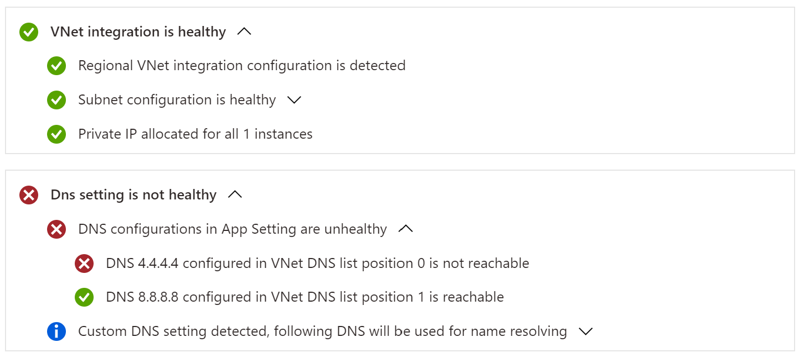
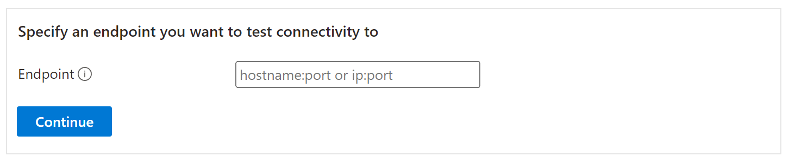
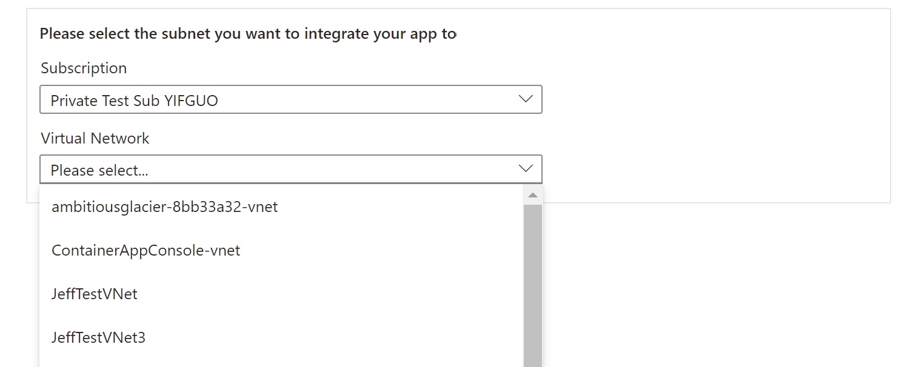
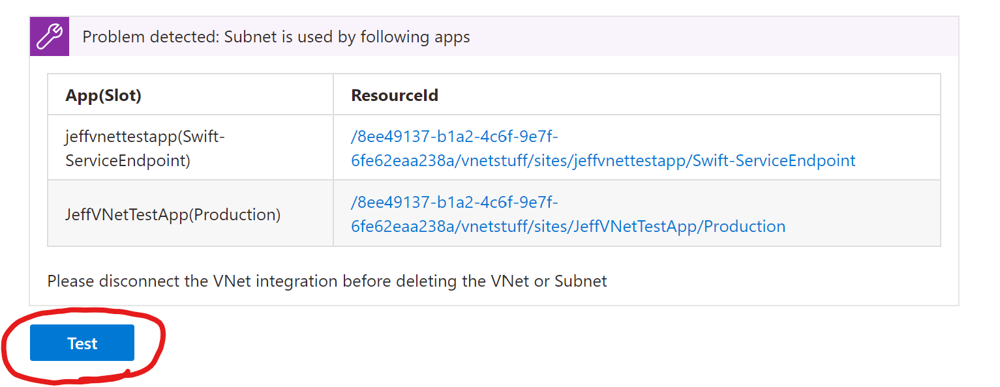
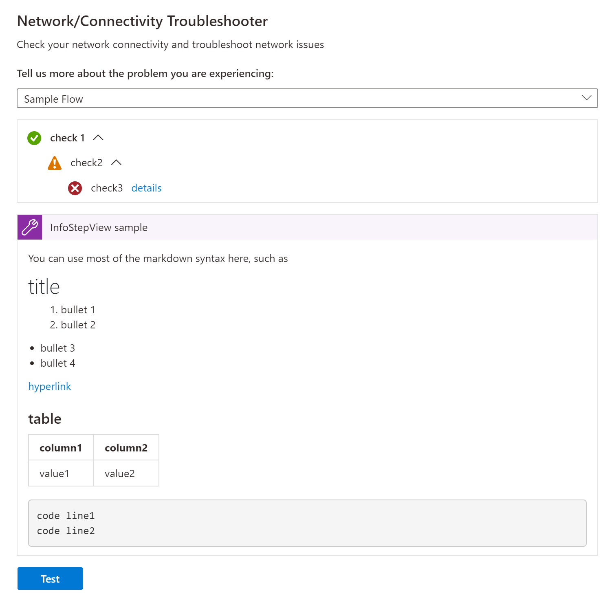
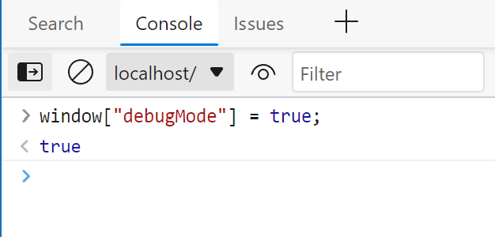
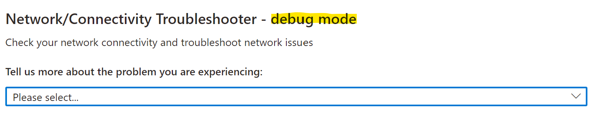
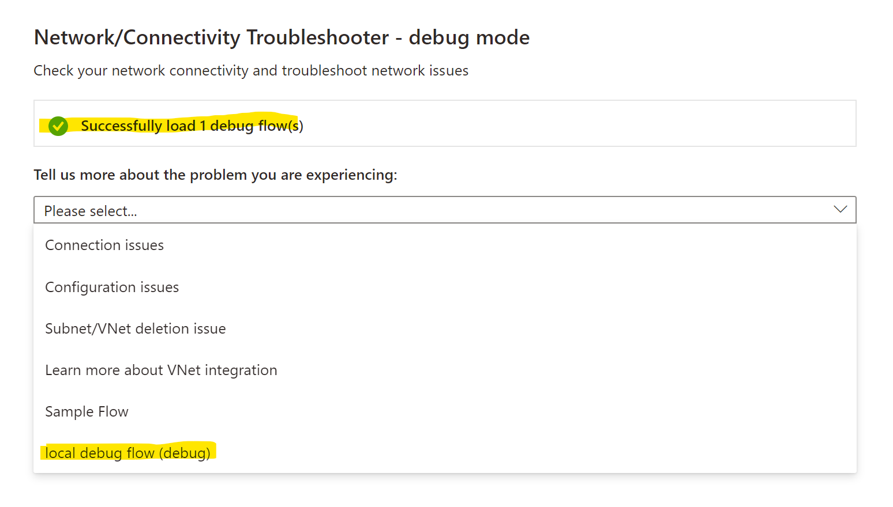
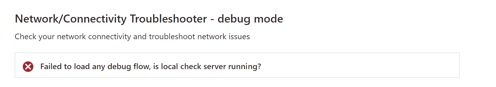

# Network Troubleshooter Checks

## What is a Network Troubleshooter Check
A Network Troubleshooter Check is a TypeScript/JavaScript class implements the interface defined in `AngularApp\projects\app-service-diagnostics\src\app\shared\components\tools\network-checks\network-check-flow.ts` as
```typescript
interface NetworkCheckFlow {
    id: string;
    title: string;
    description?: string;
    func(
        resourceInfo: any, 
        diagProvider: DiagProvider, 
        flowMgr: StepFlowManager): Promise<null>;
}
```
You can see a set of checks in the same folder as this `README.MD` such as `connectionFailureFlow.js`. These checks will be loaded by `AngularApp\projects\app-service-diagnostics\src\app\shared\components\tools\network-troubleshooter\network-troubleshooter.component.ts` and show in the dropdown in the UI of Network Troubleshooter


Once user clicks an option from dropdown, the function `func` will be executed and UI will be rendered.

## How to implement a Network Troubleshooter Check
You will need to manipulate the three parameters of the `func` function to implement the check

### resourceInfo
`resourceInfo` is the object includes the information of the Azure Resource which the Network Troubleshooter is running for. For example, if it's a WebApp, then it will include information of the site such as
```typescript
{
    resourceUri: string;
    subscriptionId: string;
    resourceGroupName: string;
    siteName: string;
    slot: string;
    ...
}
```
### diagProvider
`diagProvider` includes a set of functions (see its definition in `AngularApp\projects\app-service-diagnostics\src\app\shared\components\tools\network-checks\diag-provider.ts`). You can use these functions to fetch information from endpoints which need user ARM token (e.g. ARM API). Then you can run some logic to diagnose the problem and provide instruction to user.

### flowMgr
`flowMgr` is a `StepFlowManager` object that you can use to render the UI components.

There are 5 UI components can be rendered by `flowMgr` for now

#### 1. CheckStepView
`CheckStepView` is a set of foldable tree view checks like this


#### 2. InfoStepView
`CheckStepView` is a component with title and markdown body


#### 3. InputStepView
`InputStepView` is basically one or more input boxes and a button that user can interact with


#### 4. DropdownStepView
`DropdownStepView` is one or more dropdowns that user can select an option from them


#### 5. ButtonStepView
`DropdownStepView` is a simple button that user can click and trigger a callback function


### Sample
We provided a `sample flow` as below, check its implementation in `sampleFlow.js`. This flow will be visible only when Diagnostic Portal project is hosted locally or debug mode is turned on. 


### Debug Mode
To enter the debug mode, right click in the Network Troubleshooter UI and select Inspect (do not use F12, otherwise the DevTool will be opened in a wrong context), in the popped up DevTools window, run `window["debugMode"] = true;` in the console.


Then hit refresh button, you will see the title becomes `Network/Connectivity Troubleshooter - debug mode`


In debug mode, the Network Troubleshooter will try to load the checks from local server http://127.0.0.1:8000. Once loaded, a check with success result will appear. The options end with `(debug)` are the checks loaded from the local server.


If loading was not successful, a failed check will appear instead


Every time when refresh button is hit, Network Troubleshooter will try to reload the checks from that server

To run the server, check https://github.com/yifguoMSFT/NetworkCheckServer
